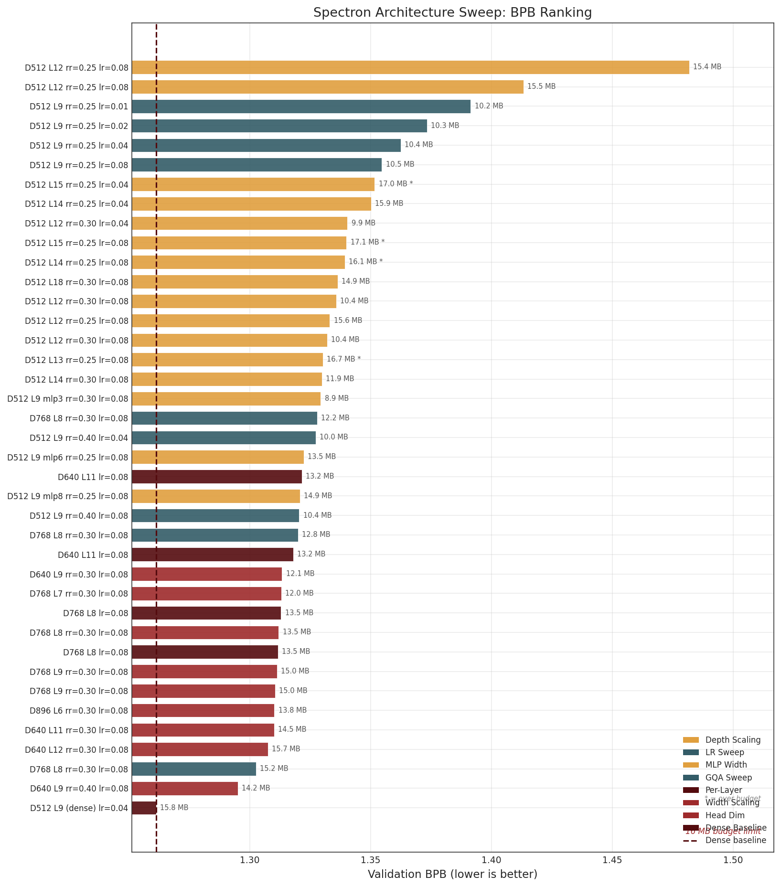
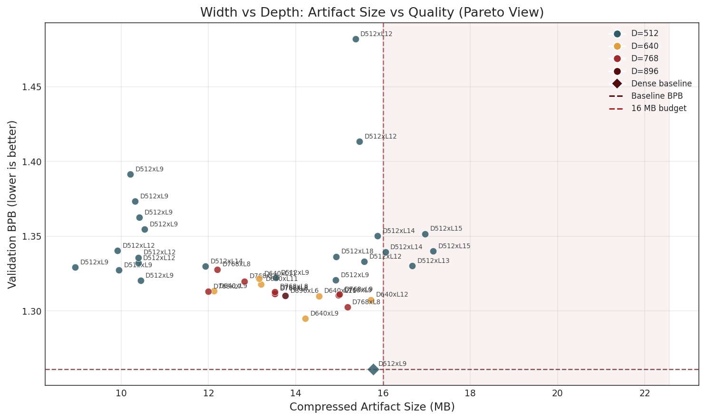
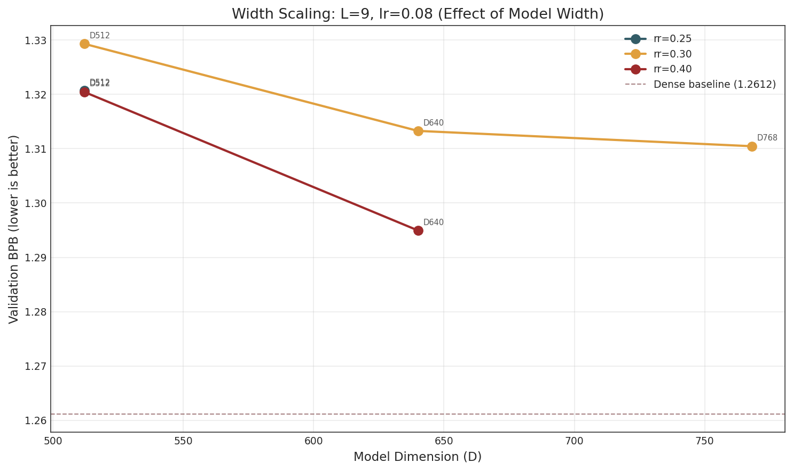
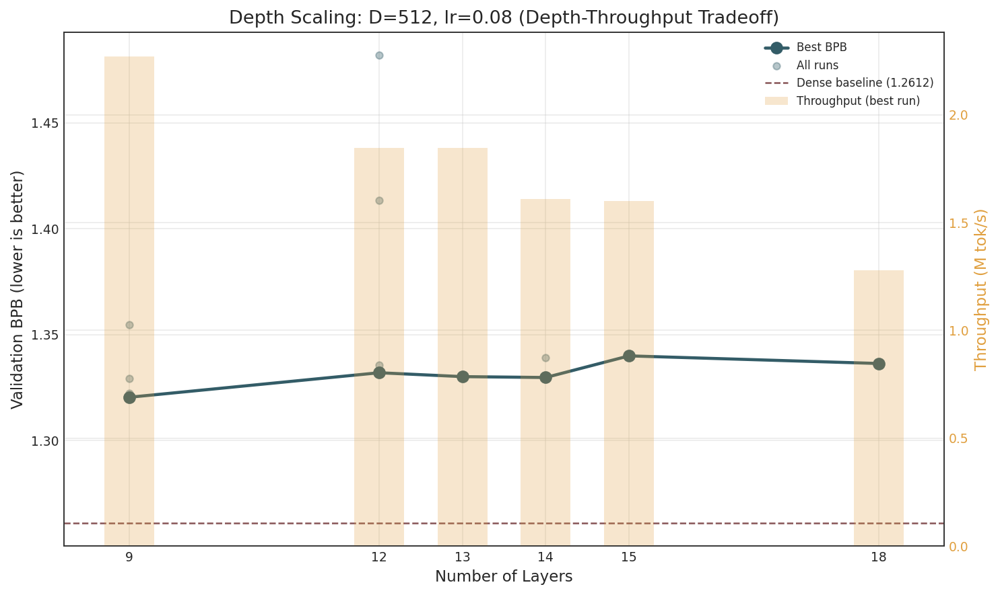
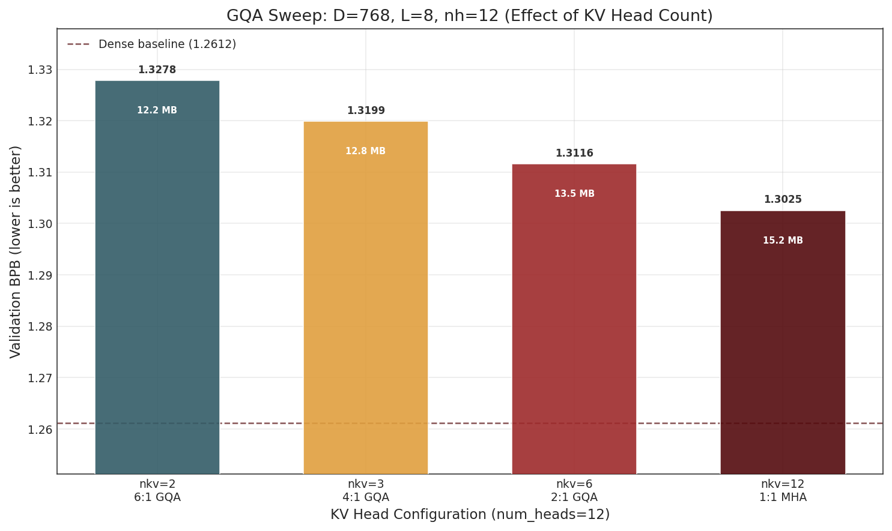
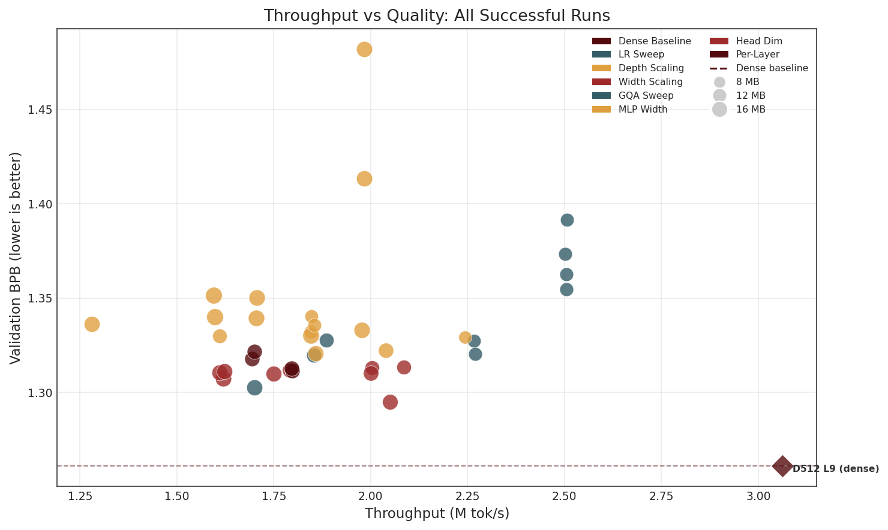

# Spectron Low-Rank Architecture Sweep Report

**Date**: 2026-04-04  
**Hardware**: 4x NVIDIA A100-SXM-64GB per run (Leonardo HPC, CINECA)  
**Training budget**: 12 minutes wallclock (720 seconds)  
**Artifact budget**: 16 MB (int8 quantization + zlib compression)  
**Evaluation metric**: Bits-per-byte (BPB) on FineWeb validation set (tokenizer-agnostic)

---

## 1. Background

The **Parameter Golf** challenge requires training the best possible language model that fits within a **16 MB compressed artifact** and trains in **under 10 minutes on 8x H100 SXM GPUs**. The evaluation metric is **bits-per-byte (BPB)** on a frozen FineWeb validation set.

We implemented the **Spectron optimizer** from Janson, Oyallon & Belilovsky (arXiv:2602.12429), which factorizes all weight matrices as W = A @ B^T and trains them with a coupled spectral update rule:

1. EMA momentum on gradients
2. Newton-Schulz orthogonalization of momentum buffers  
3. Spectral renormalization: step size rho = eta / (||A||_2 + ||B||_2 + 1)

This achieves significant parameter compression compared to dense models, at the cost of per-parameter expressivity.

---

## 2. Experimental Setup

### 2.1 Dense Baseline

A 9-layer GPT with model_dim=512, 8 attention heads (4 KV heads), relu^2 MLP (2x expansion), tied embeddings, RoPE, and tanh logit softcapping. Trained with the Muon optimizer (Newton-Schulz on dense weights) and Adam for embeddings/scalars.

| Property | Value |
|----------|-------|
| Parameters | ~7.5M |
| Artifact size | 15.77 MB |
| BPB | **1.2612** |
| Training steps | 3,715 |
| Throughput | 3.06 M tok/s |

### 2.2 Spectron Low-Rank

Identical architecture but all weight matrices are factorized as W = A @ B^T with rank = floor(rank_ratio x min(out_features, in_features)). The Spectron optimizer replaces Muon for all factorized parameters. Adam is used for embeddings and scalar/vector parameters.

### 2.3 Quantization Pipeline

Post-training quantization: float32 -> int8 (per-row quantization for matrices, per-tensor for vectors) -> zlib level 9. Tensors with <= 65,536 elements stay in float16 (this boundary is critical for artifact size, see Section 3.2).

### 2.4 Experiment Taxonomy

We ran **65 experiments** across **8 categories**, of which **39 completed successfully**, **23 failed** (infrastructure/code bugs during development), and **2 diverged** (D=576, head_dim=72 incompatible with Flash Attention).

| Category | Description | Runs |
|----------|-------------|------|
| 01_baseline | Dense Muon baseline (D=512 L=9) | 1 |
| 02_lr_sweep | Spectron learning rate sweep at D=512 L=9 | 6 |
| 03_depth_scaling | Depth scaling (L=12..18) at D=512 | 13 |
| 04_width_scaling | Width+depth scaling (D=640, 768, 896) | 8 |
| 05_gqa_sweep | GQA ratio sweep (nkv=2,3,6,12) at D=768 L=8 | 3 |
| 06_mlp_width | MLP expansion factor (3x, 6x, 8x) at D=512 | 3 |
| 07_head_dim | Head dimension comparison (64 vs 128) at D=768 | 1 |
| 08_per_layer | Per-layer rank ratio and mixed-heads configs | 5 |

All Spectron runs used rank_ratio >= 0.25 to ensure tensors exceed the 65,536-element int8 threshold, and lr=0.08 (identified as optimal in the LR sweep) unless otherwise noted.

---

## 3. Results

### 3.1 Overall Ranking (Budget-Constrained, Artifact <= 16 MB)

| Rank | Configuration | BPB | int8 BPB | Artifact | Steps | Throughput |
|------|---------------|-----|----------|----------|-------|------------|
| 1 | **Dense baseline** D512 L9 | **1.2612** | 1.2649 | 15.77 MB | 3,715 | 3.06 M tok/s |
| 2 | D640 L9 nh=10 nkv=5 rr=0.40 | 1.2950 | 1.2996 | 14.21 MB | 2,803 | 2.05 M tok/s |
| 3 | D768 L8 nh=12 **nkv=12 (MHA)** | 1.3025 | 1.3083 | 15.18 MB | 2,327 | 1.70 M tok/s |
| 4 | D640 L12 nh=10 nkv=5 | 1.3075 | 1.3117 | 15.72 MB | 2,216 | 1.62 M tok/s |
| 5 | D640 L11 nh=10 nkv=5 | 1.3101 | 1.3146 | 14.53 MB | 2,396 | 1.75 M tok/s |
| 6 | D896 L6 nh=14 nkv=7 | 1.3102 | 1.3170 | 13.76 MB | 2,735 | 2.00 M tok/s |
| 7 | D768 L9 nh=12 nkv=6 | 1.3105 | 1.3158 | 14.98 MB | 2,207 | 1.61 M tok/s |
| 8 | D768 L9 nh=6 nkv=3 **(hd=128)** | 1.3112 | 1.3171 | 15.00 MB | 2,225 | 1.62 M tok/s |
| 9 | D768 L8 mixed hd128->64 | 1.3116 | 1.3171 | 13.52 MB | 2,459 | 1.80 M tok/s |
| 10 | D768 L8 nh=12 nkv=6 | 1.3119 | 1.3180 | 13.52 MB | 2,451 | 1.79 M tok/s |

The best Spectron configuration (**D640 L9 rr=0.40, BPB=1.2950**) closes the gap to the dense baseline from +0.059 (vanilla Spectron D512 L9) to **+0.034 BPB**, a 42% reduction.

### 3.2 Width Scaling

Increasing model dimension is the single most effective lever for improving Spectron BPB.

| Dim | Layers | Heads | BPB | Artifact | Steps |
|-----|--------|-------|-----|----------|-------|
| 512 | 9 | 8/4 | 1.3204 | 10.44 MB | 3,101 |
| 640 | 9 | 10/5 | 1.3133 | 12.13 MB | 2,853 |
| 640 | 9 | 10/5 (rr=0.40) | **1.2950** | 14.21 MB | 2,803 |
| 768 | 9 | 12/6 | 1.3105 | 14.98 MB | 2,207 |
| 896 | 6 | 14/7 | 1.3102 | 13.76 MB | 2,735 |

Key observations:
- **D=640 with rr=0.40 is the sweet spot**: it achieves the best BPB (1.2950) with 1.8 MB of headroom under the 16 MB budget.
- Higher rank ratio (0.40 vs 0.30) at D=640 gives a significant +0.018 BPB improvement with only +2 MB artifact cost.
- D=896 L=6 achieves comparable BPB to D=768 L=9 but with a smaller artifact (13.76 vs 14.98 MB) and higher throughput (2.00 vs 1.61 M tok/s). Extreme width with few layers is viable.

### 3.3 Depth Scaling at D=512

| Layers | BPB | Artifact | Steps | Tokens Seen |
|--------|-----|----------|-------|-------------|
| 9 | 1.3204 | 10.44 MB | 3,101 | 1.63B |
| 12 | 1.3320 | 10.39 MB | 2,520 | 1.32B |
| 13 | 1.3302 | 16.67 MB | 2,526 | 1.32B |
| 14 | 1.3298 | 11.93 MB | 2,202 | 1.15B |
| 15 | 1.3400 | 17.15 MB | 2,182 | 1.14B |
| 18 | 1.3364 | 14.92 MB | 1,746 | 0.92B |

At fixed width (D=512), adding depth provides **diminishing returns**: L=14 improves only +0.009 BPB over L=9 but reduces throughput by 41% (3,101 -> 2,202 steps). The deeper models see far fewer tokens within the 12-minute budget, negating the capacity advantage.

L=18 is strictly worse than L=9 despite having 2x the layers, because it sees only 56% as many tokens.

### 3.4 GQA Ratio Sweep

At D=768 L=8 with rank_ratio=0.30:

| KV Heads | GQA Ratio | BPB | Artifact |
|----------|-----------|-----|----------|
| 2 | 6:1 | 1.3278 | 12.21 MB |
| 3 | 4:1 | 1.3199 | 12.82 MB |
| 6 | 2:1 | 1.3119 | 13.52 MB |
| **12** | **1:1 (MHA)** | **1.3025** | **15.18 MB** |

**Full multi-head attention (nkv=nh=12) is significantly better than GQA** in the low-rank regime. The gap between MHA and 6:1 GQA is 0.025 BPB. This is because low-rank factorization already compresses the Q/K/V projections; further reducing KV capacity via GQA compounds the information bottleneck.

### 3.5 Head Dimension: 64 vs 128

At D=768 L=9:
- **head_dim=64** (nh=12, nkv=6): BPB = 1.3105
- **head_dim=128** (nh=6, nkv=3): BPB = 1.3112

The difference is negligible (0.0007 BPB). Fewer, larger heads work equally well, and both use comparable artifact space (~15 MB). This suggests the head dimension choice can be driven by hardware efficiency rather than model quality.

### 3.6 MLP Width

At D=512 L=9:

| MLP Mult | BPB | Artifact | Steps |
|----------|-----|----------|-------|
| 2 | 1.3204 | 10.44 MB | 3,101 |
| 3 | 1.3293 | 8.94 MB | 3,068 |
| 6 | 1.3223 | 13.54 MB | 2,781 |
| 8 | 1.3207 | 14.92 MB | 2,543 |

Wider MLPs provide negligible benefit: mlp=8 matches mlp=2 BPB (1.321 vs 1.320) but uses 4.5 MB more artifact space. The rank bottleneck limits the expressivity gain from wider hidden dimensions.

### 3.7 Per-Layer Configurations

| Configuration | BPB | Artifact | vs Uniform |
|---------------|-----|----------|------------|
| D640 L11 uniform rr=0.30 | 1.3101 | 14.53 MB | baseline |
| D640 L11 tapered (rr 0.40->0.15) | 1.3215 | 13.16 MB | -0.011 (worse) |
| D640 L11 inv. tapered (rr 0.15->0.40) | 1.3180 | 13.20 MB | -0.008 (worse) |
| D768 L8 uniform heads | 1.3119 | 13.52 MB | baseline |
| D768 L8 mixed hd128->64 | 1.3116 | 13.52 MB | +0.000 (tie) |
| D768 L8 mixed hd64->128 | 1.3129 | 13.52 MB | -0.001 (worse) |

Per-layer heterogeneous configurations do not improve over uniform settings. Tapered rank ratio (either direction) is worse than uniform, likely because the average rank is lower while artifact size is similar. Mixed head dimensions are essentially equivalent to uniform.

### 3.8 Throughput vs Quality

The dense baseline dominates in throughput (3.06 M tok/s) due to fused kernels. Spectron configs trade throughput for parameter efficiency, clustering at 1.6-2.1 M tok/s. The throughput penalty is 30-50% relative to dense, mainly due to the double matmul in LowRankLinear forward pass (x @ B then @ A^T).

---

## 4. Key Findings

1. **The dense baseline (BPB=1.2612) remains unbeaten.** The best Spectron configuration (D640 L9 rr=0.40) reaches 1.2950, a gap of +0.034 BPB. Low-rank factorization with the Spectron optimizer does not yet match dense training at equal artifact budget.

2. **Width > Depth for Spectron.** Wider models (D=640-768) significantly outperform deeper narrow models (D=512 L=12-18) because they maintain higher throughput and see more training tokens within the fixed time budget.

3. **Higher rank ratio is always better when budget allows.** rr=0.40 at D=640 (14.21 MB) beats rr=0.30 (12.13 MB) by 0.018 BPB. The artifact budget should be filled as much as possible.

4. **Full MHA strongly outperforms GQA in the low-rank regime.** The information bottleneck from factorization makes preserving KV capacity critical. This is the opposite of the standard dense-model recommendation.

5. **Head dimension (64 vs 128) is irrelevant.** Choose based on hardware efficiency.

6. **Per-layer heterogeneous architectures do not help.** Tapered rank and mixed head dimensions offer no improvement over uniform configurations.

7. **MLP width scaling is ineffective under rank factorization.** The rank bottleneck prevents wider MLPs from adding expressivity.

---

## 5. Recommendations

- **Best submission candidate**: D640 L9 nh=10 nkv=5 rr=0.40 lr=0.08 (BPB=1.2950, 14.21 MB)
- **Explore**: D640 L9 rr=0.45 or rr=0.50 to fill remaining 1.8 MB budget
- **Explore**: D768 L8 nkv=12 (full MHA) with higher rank ratio to fill 0.8 MB headroom
- **Explore**: Hybrid dense+low-rank models (some layers dense via DENSE_LAYERS env var) to combine the throughput of dense with the compression of low-rank
- **Do not pursue**: Deeper models at D=512, wider MLPs, per-layer heterogeneous configs

---

## 6. Reproducibility

All experiments were executed on the Leonardo HPC cluster at CINECA using the `IscrC_YENDRI` project allocation. Each run was tracked via `tools/launch_run.sh` which records:
- Full hyperparameters in `meta.json`
- Training metrics in JSONL format
- Code snapshot at launch time
- Git commit SHA (e2d0848, branch: main)

Run artifacts are stored on `$FAST` scratch (`/leonardo_scratch/fast/IscrC_YENDRI/parameter-golf/runs/`) with symlinks in `outputs/runs/` organized by experiment category.

**Training script**: `train_gpt_low_rank.py` (1447 lines)  
**SLURM batch script**: `scripts/spectron_arch_sweep.sh`  
**Plot generation**: `tools/generate_report_plots.py`  
**Dashboard**: `outputs/dashboard.html` (auto-generated, 65 runs)
